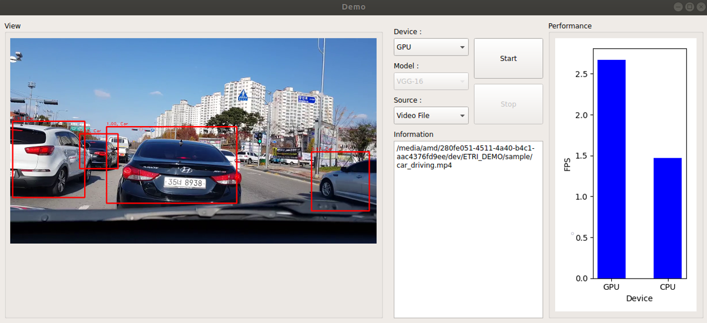

# PlaidML-CPUvsGPU
PyQT5 based GUI application for performance comparison between Tensorflow (CPU) and PlaidML (GPU)



### Environment

CPU : Intel i7-8086K  
GPU : Gigabyte Radeon RX Vega 64 Silver HBM2 8GB

OS : Ubuntu 18.04  
Driver : AMD-GPUPRO 18.20

Python 3.5  
Keras 2.2.2  
Tensorflow 1.10  
PlaidML 0.3.5

### Usage

We used SSD (single shot multibox detector) model for internal object detection algorithm.  
Also, we were able to develop this application with a lot of inspiration from the repository below.

Download the pre-trained weights from [ssd_kerasV2](https://github.com/tanakataiki/ssd_kerasV2) named `VGG16SSD300weights_voc_2007_class20.hdf5`  
Save the weight file in the `weight` directory.

Create anaconda environment using `environment.yml` and following command:
```
$ conda env create
```

Activate virtual envitonment and start the application
```
$ conda activate demo
(demo) $ python main.py
```